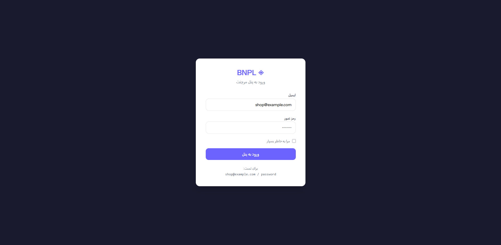
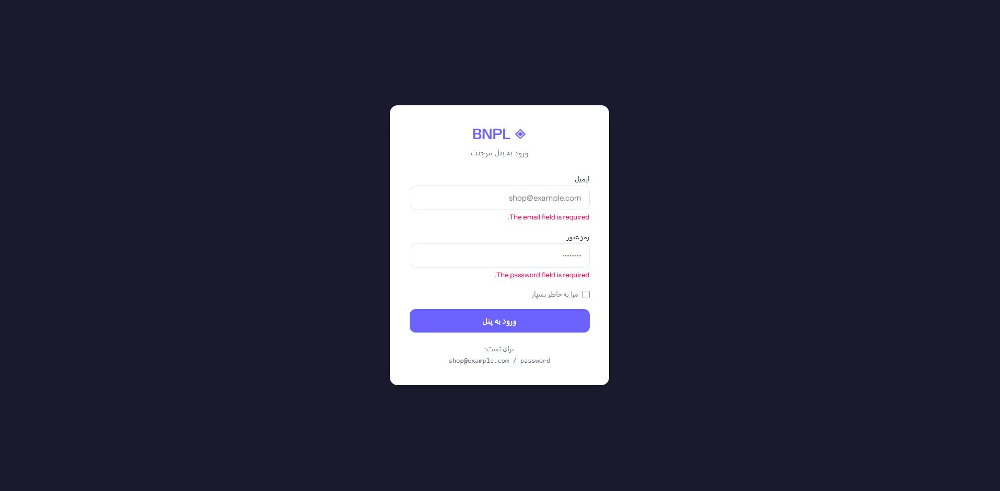
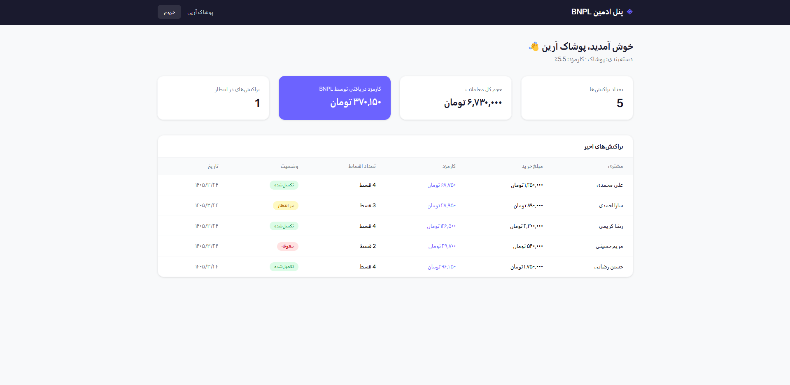

# ◈ BNPL Merchant Panel

A web application built with Laravel and React that allows partner stores (merchants) to log in and track their BNPL transactions. This project is part of the **Noavaran BNPL** ecosystem and follows a **B2B (C2B2B)** business model.

---

## 📸 Screenshots

### Login Page



### Merchant Dashboard


---

## 🛠️ Tech Stack

| Layer | Technology |
|---|---|
| Backend | Laravel 11 |
| Frontend | React 18 + TypeScript |
| Bridge | Inertia.js |
| Styling | Tailwind CSS v4 |
| Build Tool | Vite |
| Database | SQLite |
| Local Environment | Laravel Herd |
| Version Control | Git + GitHub |

---

## 📐 Architecture

This project uses a **Monolithic + SPA** architecture:

- **Laravel** handles authentication, server-side logic, routing, and data delivery
- **Inertia.js** acts as the bridge between Laravel and React
- **React** handles client-side rendering
- **Tailwind CSS v4** provides styling with a custom design system

---

## 🎨 Design System & Brand

Brand colors are defined in `resources/css/app.css` using the `@theme` directive in Tailwind v4:

| Name | Hex | Usage |
|---|---|---|
| Primary | `#6C63FF` | Buttons, links, highlights |
| Secondary | `#F50057` | Accents and emphasis |
| Brand Dark | `#1A1A2E` | Navbar, dark backgrounds |
| Muted | `#6B7280` | Secondary text |

Primary font: **Vazirmatn** (with Persian language support)

---

## 🏪 Merchant Onboarding Process

This panel reflects the following B2B onboarding flow for a partner store (e.g. a clothing shop) joining the BNPL service:

1. The store submits a partnership request to the BNPL provider
2. The provider reviews the store's credit and legal standing
3. A contract is signed, defining the commission rate
4. A **Merchant Account** is created for the store
5. The store integrates the BNPL checkout option (widget/API) into its sales channel
6. Customers can now pay for purchases in installments
7. The store logs into this panel to track transactions, commissions, and settlement status

---

## 🚀 Pages & Routes

- **/login** — Merchant login
- **/merchant/dashboard** — Merchant dashboard (stats + transactions table)
- **/logout** — Logout

---

## 🗄️ Database Schema

### `merchants`
| Field | Description |
|---|---|
| user_id | Linked user account (for login) |
| store_name | Name of the partner store |
| category | Store category (e.g. Clothing) |
| commission_rate | Agreed commission percentage |
| status | active / pending / suspended |

### `transactions`
| Field | Description |
|---|---|
| merchant_id | Related store |
| customer_name | End customer name |
| amount | Total purchase amount |
| commission | Commission earned by BNPL |
| installments | Number of installments |
| status | completed / pending / overdue |

---

## 💡 Development Methodology

### Agile
The project was developed following Agile principles — instead of planning everything upfront, work was broken into small increments and delivered iteratively.

### Scrum
Work was structured around Sprints:
- **Sprint 1** — Project setup, database design, and branding
- **Sprint 2** — Authentication system (login/logout)
- **Sprint 3** — Merchant dashboard and transactions view

### MVP
This project is a true MVP — only the essential merchant-facing features have been implemented (login + transaction overview). Advanced features (settlement reports, multi-user roles, notifications) will be added in future sprints.

---

## ⚙️ Installation

**Prerequisites:**
- PHP 8.2+
- Node.js 20+
- Laravel Herd
- Composer

**Steps:**

```bash
# Clone the repository
git clone https://github.com/USERNAME/bnpl-merchant-panel.git
cd bnpl-merchant-panel

# Install dependencies
composer install
npm install

# Set up environment
cp .env.example .env
php artisan key:generate

# Run migrations and seed test data
php artisan migrate --seed

# Run the project
npm run dev
```

The site will be available at `http://bnpl-merchant-panel.test`

**Test credentials:**
- Email: `shop@example.com`
- Password: `password`

---

## 📁 Project Structure

```plaintext
resources/js/
├── layouts/
│   └── MerchantLayout.tsx     # Shared layout (Navbar + Logout)
├── pages/
│   ├── auth/
│   │   └── login.tsx          # Login page
│   └── merchant/
│       └── dashboard.tsx      # Merchant dashboard
app/
├── Models/
│   ├── Merchant.php           # Merchant model
│   └── Transaction.php        # Transaction model
└── Http/Controllers/
    ├── Auth/
    │   └── AuthenticatedSessionController.php  # Login/logout logic
    └── MerchantDashboardController.php         # Dashboard data
database/
└── seeders/
    └── MerchantSeeder.php     # Test merchant & transactions
```

---

## 👤 Developer — Sasan Nikjoo
